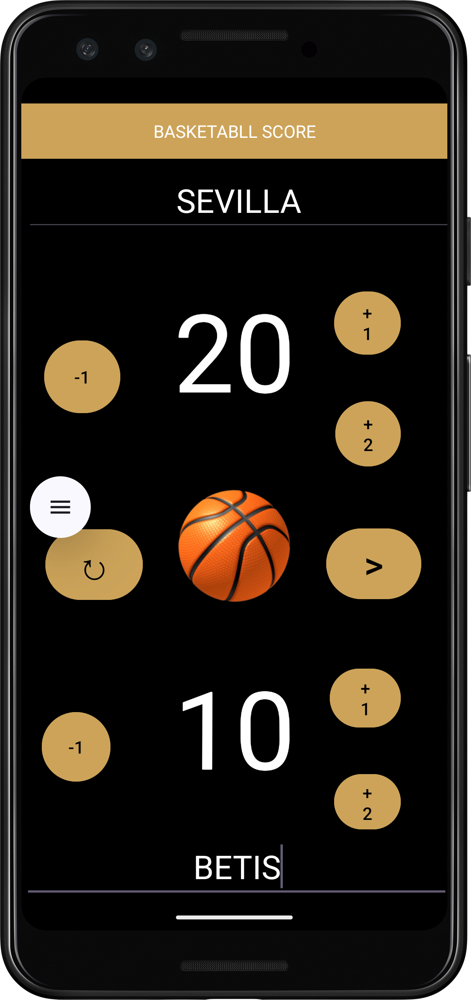

# 🏀 **BasketballApp**  
Aplicación Android para gestionar marcadores de baloncesto

<div align="center">


### 📱 Android Scoreboard App  
**Rápida, sencilla y perfecta para registrar resultados.**

---

### 🚀 *Tecnologías usadas*  


---

</div>

---

## 📄 **Descripción**
BasketballApp es una aplicación Android que permite registrar puntajes entre dos equipos (Local y Visitante), mostrar quién fue el ganador o si hubo un empate y gestionar el partido desde una interfaz moderna y sencilla.

Incluye:
- Gestión de puntos por equipo  
- Pantalla de resultado  
- DataBinding para un código más limpio  
- Navegación entre actividades  

---

## 🎯 **Características principales**
- 🏠 Pantalla inicial para ingresar nombres de equipos  
- 🔢 Botones para sumar puntos  
- 🏆 Pantalla de resultado mostrando el ganador  
- 🔄 Reinicio del partido  
- 📱 UI moderna con EdgeToEdge  
- 🧩 Implementación con DataBinding  

---

## 🛠️ **Instalación**

```bash
git clone https://github.com/PabloBg19/BasketballApp.git
cd BasketballApp
```

---

## 🧰 **Tecnologías**
- Java  
- AndroidX  
- DataBinding  
- EdgeToEdge API  
- Material Components  

---

## 📸 **Capturas de pantalla**

| Pantalla principal | Resultado |
|-------------------|-----------|
|  |  |

---

## 📂 **Estructura del Proyecto**

```
app/
 ├─ java/com/example/basketballscoreapp/
 │   ├─ MainActivity.java
 │   ├─ resultado.java
 ├─ res/
 └─ AndroidManifest.xml
```

---

## 🚀 **Cómo usar la app**

1. Introducir nombres de equipos  
2. Añadir puntos  
3. Pulsar "Calcular resultado"  
4. Ver ganador o empate  
5. Reiniciar partido  

---

## 🔧 **Mejoras futuras**
- Historial de partidos  
- Colores personalizados  
- Gráficas de rendimiento  
- Torneos  
- Modo oscuro  
- Integración online  

---

# 📝 **Informe del Proyecto**

## 📌 1. Introducción
BasketballApp es una aplicación Android desarrollada para gestionar marcadores de baloncesto, aprendiendo navegación, DataBinding y diseño moderno en Android.

---

## 🎯 2. Objetivos del Proyecto
- Aprender desarrollo Android  
- Implementar DataBinding  
- Crear UI responsive  
- Usar actividades conectadas mediante Intents  

---

## 🧩 3. Descripción Funcional
Pantallas principales:

- **MainActivity** → suma de puntos y nombres  
- **resultado.java** → muestra ganador o empate  

Flujo:
1. Registrar nombres  
2. Sumar puntos  
3. Ver resultado  
4. Reiniciar  

---

## 🏗️ 4. Tecnologías
- Java  
- Android Studio  
- DataBinding  
- AndroidX  
- EdgeToEdge  
- Material Design  

---

## ⚠️ 5. Problemas encontrados
### 🔧 1. DataBinding
- Fallos en layouts por no usar `<layout>`  
- Errores de referencia a vistas  

### 🔧 2. Intents
- Datos nulos al enviarse con claves incorrectas  

### 🔧 3. Actualización del marcador
- Conversión String → int incorrecta  
- UI no actualizada  

### 🔧 4. UI
- Elementos desalineados  
- Problemas en pantallas pequeñas  

### 🔧 5. Ciclo de vida
- Riesgo de perder datos al rotar la pantalla  

---

## ✔️ 6. Soluciones aplicadas
### 🛠️ 1. Configurar DataBinding correctamente
- build.gradle actualizado  
- XML corregidos  

### 🛠️ 2. Intents estructurados
- Claves constantes  
- Comprobación de nulos  

### 🛠️ 3. Conversión segura de datos
- Métodos para sumar puntos  
- Integer.parseInt controlado  

### 🛠️ 4. UI mejorada
- ConstraintLayout  
- Tests en varios emuladores  

### 🛠️ 5. Persistencia
- Código preparado para onSaveInstanceState  

---

## 🏁 7. Conclusiones
BasketballApp cumple la función de gestionar un partido de baloncesto y sirve como base sólida para aprender Android.  
Es ampliable, estable y clara tanto en código como en interfaz.

---

## ⭐ **Apoya este proyecto**
Si te ayudó, deja una ⭐ en GitHub:
👉 https://github.com/PabloBg19/BasketballApp
